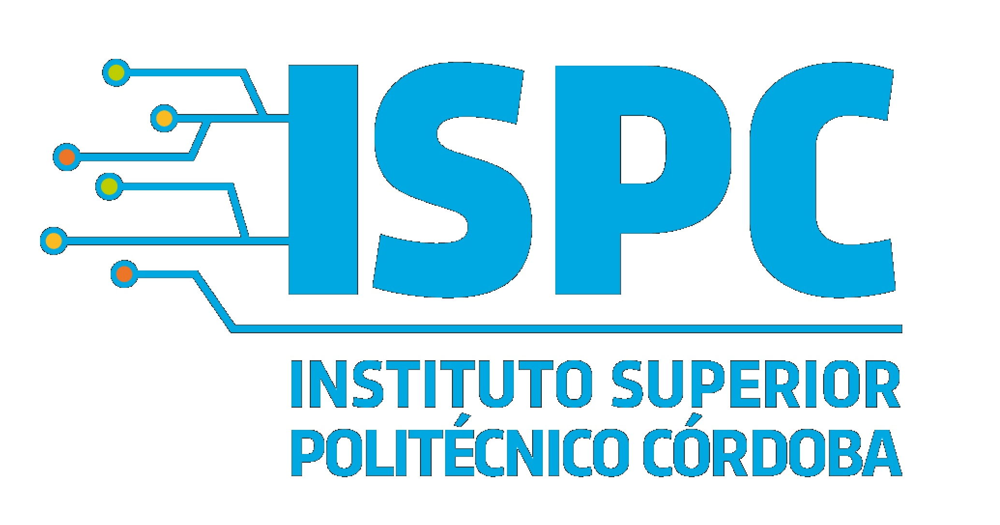

     

    <h2 align="center">Tecnicatura Superior en Ciencia de Datos e Inteligencia Artificial </h2>
     <h3 align="center"> Practica Profecionalizante 1 - 2023 </h3>
     <h3>EQUIPO N°19 (Alumnos de ambas comisiones)</h3>

 

     <h4 align="left"> Docente: </h4>
  <h4 align="left">Integrantes: </h4>
     <h4 <ul type=”A”>
       <li> Lamine Mechedou</li>
       <li> Micaela Kler </l>
       <li>Liliana Elizabet Lamas</li>
       <li>Juan Jure</li>
       <li>Carol Peves</li>
       <li>Rubí Nohemí García Alarcón</li>
      </ul>  </h4>

 

    <h2 align="center">Proyecto “ Proyecto (_______)” </h2>

 

    <h2 align="center">Objetivo: </h2>

 

          <h4 align="left">  El objetivo de este trabajo _________</h4>
      <h4 align="left">  _____________  </h4>

 

    <h2 align="center">Hipótesis: </h2>

 
      <h4 align="left">  _________ </h4>

 

    <h2 align="center"> Aplicación </h2>

 
      <h4 align="left"> _______ </h4>
      <h4 align="left"> ________  </h4>

 

    <h2 align="center">________ </h2>
    <h4 align="left">  _______ </h4>
     <h4 align="left"> _____  </h4>
     <h4 align="left"> ________  </h4>

 

    <h2 align="center">CONCLUSIONES </h2>   
      <h4(_________)  </h4>
       <h4 (________)   </h4>
       

       

       

      

